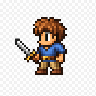
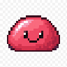
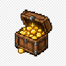
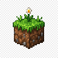
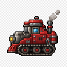

# Modular Game Engine

<p align="center">
  
  &nbsp;
  
  &nbsp;
  
  &nbsp;
  
  &nbsp;
  
  &nbsp;
  
</p>

<p align="center">
  <strong>Um protótipo open source de jogo de PC focado em comunidade e mods.</strong>
</p>

<p align="center">
  <a href="https://github.com/dreadpiratejhonatan/game/actions"></a>
  <a href="LICENSE"></a>
  <a href="docs/MODDING.md"></a>
  <a href="https://github.com/dreadpiratejhonatan/game/issues"></a>
</p>

Mistura a fantasia de um ARPG (o espírito de *Diablo*), o controle e a leitura tática de um RTS (*StarCraft*), e a liberdade de esquadrões de um sandbox (*Kenshi*) — com uma regra de ouro:

> **O conteúdo não mora no código. Mora nos mods.**

O jogo é gratuito por natureza do projeto (MIT), feito para ser estendido por qualquer pessoa com um editor de texto e vontade de criar.

---

## Por que este projeto existe


A maioria dos jogos “aceita mods” como um extra. Aqui o caminho é o inverso:

<br clear="all" />

| Em jogos tradicionais | Aqui |
|----------------------|------|
| Stats e unidades no código | Tudo em JSON em `data/` |
| Patch = recompilar | Patch = editar arquivo / instalar pasta |
| Comunidade adapta o que sobra | Comunidade é o centro do design |

Queremos um motor **suave de jogar**, **claro de manter** e **extremamente adaptável**, para que features novas (loot, inventário, esquadrões, skills…) cresçam sem destruir a capacidade de moddar.

### Visão de gameplay

| | |
|:---:|:---|
|  | **ARPG** — personagem principal, clique para mover/atacar, progressão futura |
|  | **RTS** — leitura espacial, cursor de comando, combate em grupo, facções |
|  | **Sandbox de esquadrões** — aliados, ordens, mundo que continua sem você |

### Visão de arte (futura)


2D pixel art com leitura lateral/isométrica (referência de energia: *Metal Slug*).  
Hoje o protótipo usa sprites procedurais de propósito — a arquitetura já espera arte real depois.

---

## Estado atual (protótipo jogável)

 Já dá para entrar no mundo, andar, lutar e carregar mods.

<br />

Já funciona:

- Personagem com clique no chão / clique em inimigo
- Facções (`player` / `ally` / `enemy`)
- Combate com perseguição, dano e morte
- Câmera em mundo maior que a tela
- Cursor estilo RTS (verde = comando, vermelho = ataque)
- Pipeline de mods (`base_mod` + `user_mods`)
- Cena baseline reproduzível (`scenes/baseline.json`)
- CI (build + smoke) na `main`

Ainda não é o jogo final — é a **fundação** onde o jogo final vai nascer.

---

## Jogar agora

**Requisitos:** [.NET 8 SDK](https://dotnet.microsoft.com/download/dotnet/8.0)

```bash
git clone https://github.com/dreadpiratejhonatan/game.git
cd game
dotnet run
```

Ou abra `ModularGameEngine.sln` no Visual Studio e pressione **F5**.

### Controles

| Input | Ação |
|-------|------|
| Clique no chão | Mover o personagem |
| Clique no inimigo | Perseguir e atacar |
| F1 | Modo debug (overlay + ferramentas) |
| Espaço | Spawn aleatório (**somente com debug ligado**) |
| ESC | Sair |

### Validar instalação (sem abrir janela)

```bash
dotnet run -- --smoke
```

Deve imprimir `SMOKE OK`. Isso também roda no GitHub Actions a cada push/PR.

---

## Mods em 60 segundos

<p>
  
  
</p>

1. Copie `data/user_mods/example_hostile_blob/`
2. Renomeie a pasta e edite `mod.json` + `units.json`
3. `dotnet run` — o console confirma o carregamento

Documentação:

- [Guia de mods](docs/MODDING.md)
- [Contrato estável v1](docs/MOD_CONTRACT.md) — o que não vamos quebrar sem aviso
- [Estrutura do projeto](docs/ORGANIZED_STRUCTURE.md)

Desativar um mod sem apagar: renomeie a pasta para começar com `_` (ex.: `_meu_mod`).

---

## Como o código está pensado

```text
src/Engine/     → núcleo reutilizável (ECS, câmera, loop)
src/Game/       → gameplay (systems, input, spawn)
src/Mods/       → loader + contratos JSON
data/base_mod/  → conteúdo oficial
data/user_mods/ → mods da comunidade
docs/           → documentação
```

**Regra de contribuição:** uma feature = componentes + sistema + (se precisar) JSON.  
O `GameEngine` só orquestra — não acumula regra de jogo.

- [Como contribuir](CONTRIBUTING.md)
- [Fluxo de branches / PRs](docs/BRANCHING.md)
- [Roadmap em issues](https://github.com/dreadpiratejhonatan/game/issues)

---

## Stack

| Camada | Tecnologia |
|--------|------------|
| Linguagem | C# 12 |
| Runtime | .NET 8 |
| Gráficos | MonoGame 3.8 |
| Dados | System.Text.Json |
| Licença | MIT |

---

## Roadmap (epics)


O que vem pela frente está aberto na aba de issues — começando por loot, inventário, esquadrões, HUD, save/load e mais tipos de conteúdo modável.

Quer ajudar? Pegue uma issue, abra uma branch `feature/...` e mande um PR. A `main` precisa continuar jogável.

---

## Licença

[MIT](LICENSE) — use, modifique, redistribua, faça forks e mods.

<p align="center">
  
  
  
</p>

<p align="center">
  O intuito não é proteger o jogo da comunidade.<br />
  É <strong>construir o jogo <em>com</em> a comunidade</strong>.
</p>
